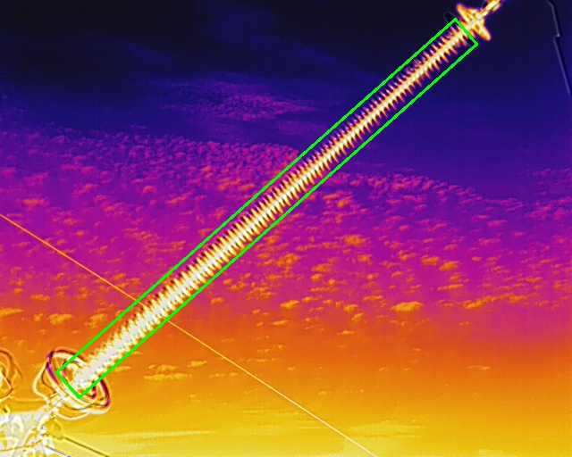
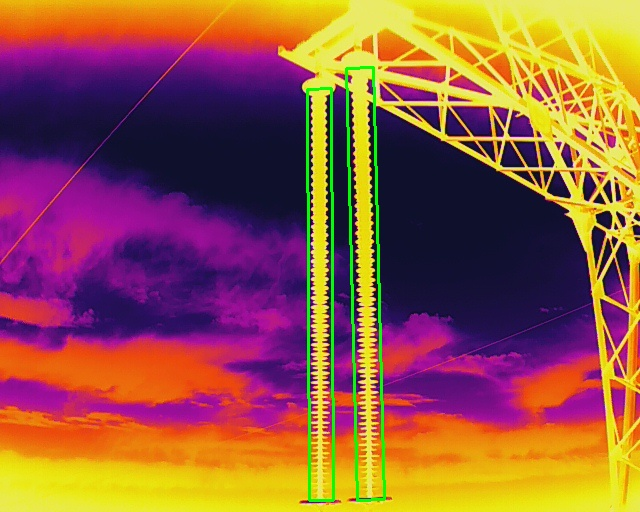
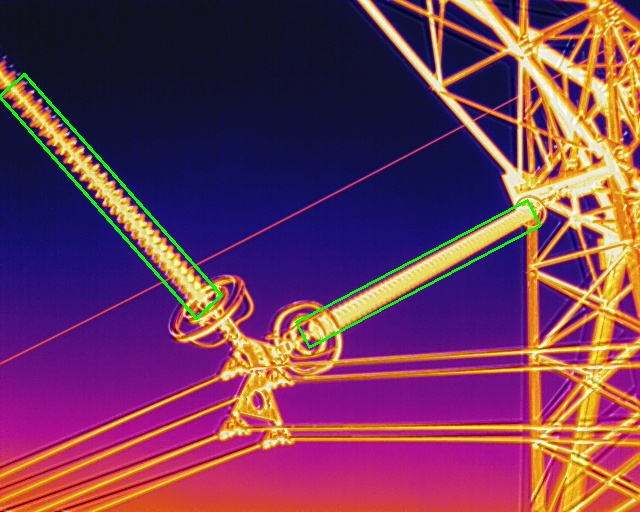
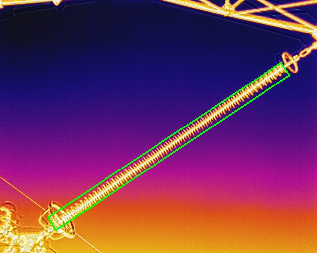
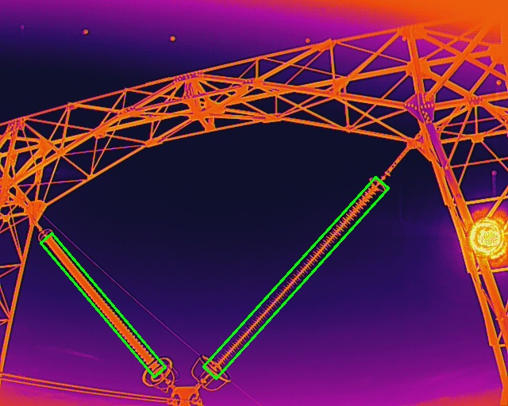

# <div align="center">R-RetinaNet</div>

## Abstract
This project was built for for arbitrary-oriented object detection, named R-RetinaNet. 
Note that this code refer to [ming71#Rotated-RetinaNet](https://github.com/ming71/Rotated-RetinaNet)


## Performance and benchmark
This implementation reaches 26 fps on RTX 3080, and nearly to realtime on jetosn nx with TensorRT.


## Getting Started
### Installation
Build the Cython  and CUDA modules:
```
cd $ROOT/utils
sh make.sh
```

Install DotaDevKit:

```
sudo apt-get install swig
swig -c++ -python polyiou.i
python3 setup.py build_ext --inplace
```

### Inference

```
python3 demo.py
```

### Train
1. Partition data to train, val and test set with $ROOT/datasets/partition_dataset.py
```
cd $ROOT/datasets
python3 partition_dataset.py
```
2. generate train files with $ROOT/datasets/partition_dataset.py
```
cd $ROOT/datasets
python3 generate_imageset.py
```
3. start training:
```
python3 train.py
```

## <div align="center">Demo</div>
<p align="center"></p>
<p align="center"></p>
<p align="center"></p>
<p align="center"></p>
<p align="center"></p>
